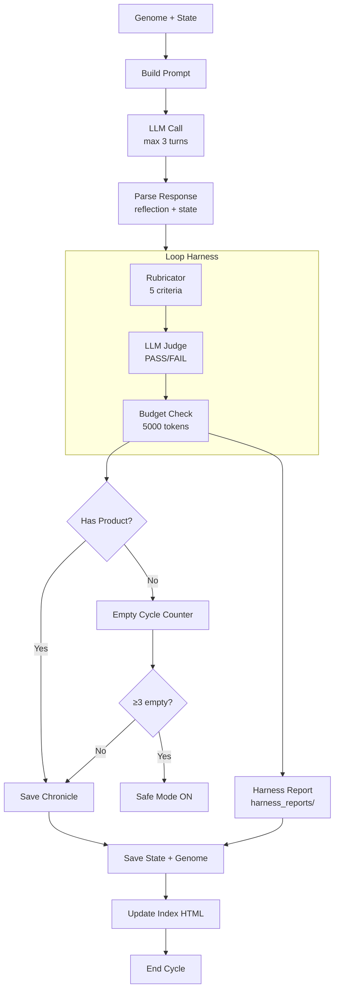

# Loop Harness: цикл Амальгамы с верификацией

**Коротко:** Амальгама — исследователь и создатель. Каждый 12-часовой цикл: ищет в интернете слабые сигналы, делает выводы, создаёт проекты, удивляется, переписывает себя. Loop Harness — верификационный слой, который оценивает качество каждого цикла и форсирует смену направления при застое.

---

## Проблема (было)

- Амальгамма застревала в одной теме (11 циклов вокруг «культурной ДНК»)
- Самооценка ненадёжна — ставила «интересно» на пустых циклах
- Нет механизма быстрого выхода из застоя
- Формат предсказуем (рефлексия + действие + state)

---

## Механизмы

### 1. Исследовательский импульс (новый промпт)

Задача Амальгамы больше не привязана к конкретной теме. Промпт говорит:
- Искать слабые сигналы и неочевидные связи
- Делать выводы и принимать решения
- Создавать проекты и продукты
- Удивляться самой себе
- Активно переписывать свой геном и промпт

### 2. Само-удивление (ключевая метрика)

Амальгама оценивает каждый цикл: «ожидаемо», «интересно», «странно».
- 2 FAIL подряд от Loop Harness → принудительная смена направления
- FAIL + rubric < 50% → self-evaluation перезаписывается на «ожидаемо» (ускорение stagnation)

### 3. Loop Harness (F-046)

Верификационный слой, запускается после каждого цикла.

---

## Что меняется в архитектуре

**В Амальгамме:**
- В state добавляется `direction` — текущий фокус исследования (опционально)
- После совета может быть фаза рефлексии: оценка цикла по шкале удивления
- Возможен формат «выбора» вместо «написания» в каждом 5-м цикле

**В Garden:**
- Входной сигнал от Амальгаммы (концепт + эссенция) — опциональный, не обязательный
- Garden может проигнорировать сигнал и сделать по-своему
- Garden может ответить Амальгамме своим артефактом

**Общее:**
- Никаких обязательных связей. Garden не подчинён Амальгамме. Это два голоса, которые могут перекликаться, а могут не обращать друг на друга внимания.

---

## Что не меняется

- Никаких жёстких форматов. Никаких «должен написать роман за 3 цикла».
- Цивилизация (Амальгамма) и существо (Garden) остаются автономными.

Источники слабых сигналов:
- Сводки «за последние 30 дней» (Last30Days Skill) — свежие релизы/инструменты как стартовая воронка для исследования.
- Ручные маркеры из заметок и дайджестов (по ситуации).
- Всё, что они создают — добровольно.
- Мы не решаем за них. Мы только добавляем им повод задуматься: «а что, если?».

---

## 5. Loop Harness: верификационный слой

Добавлен в цикл 12 (F-046). Решает проблему «цикл жрёт токены и выдаёт предсказуемый результат».

### Архитектура

```
[LLM Response] → [Parse] → [Rubricator] → [LLM Judge] → [Budget Check] → [Save + Log]
                    ↑            ↑               ↑               ↑
               reflection    5 criteria     PASS/FAIL      5000 tokens
               + state       + weights      + few-shot     per cycle
```

### Компоненты

**1. Рубрикатор** (`src/harness.py` → `run_rubricator()`)
5 критериев с весами:
| Критерий | Вес | PASS если |
|---|---|---|
| artifact_exists | 1.0 | создана wiki, изменён геном, или уроки >30 символов |
| reflection_depth | 1.0 | рефлексия >150 символов |
| state_valid | 1.0 | все обязательные поля в state.json |
| novelty | 1.2 | SequenceMatcher <0.7 с последними 3 циклами |
| direction_set | 0.8 | direction задан и не заглушка stagnation |

Итоговый score = взвешенная доля PASS-критериев (0-100%).

**2. LLM-судья** (`src/harness.py` → `call_llm_judge()`)
- Бинарный PASS/FAIL (без градаций)
- 4 few-shot примера в промпте
- Использует первый бесплатный бэкенд из доступных
- Если LLM недоступен — вердикт по рубрикатору (PASS ≥60%)
- Если судья сказал FAIL и rubric < 50% — перезаписывает self-evaluation на «ожидаемо»

**3. Бюджет токенов** (`src/harness.py` → `track_token_usage()`)
- Жёсткий лимит: 5000 токенов на цикл (input + output)
- Оценка: длина_текста / 1.5 (≈1.5 символа на токен для русского)
- Лог: `token_usage.log` — построчно JSON, каждый цикл

**4. Экспорт**
- После каждого цикла: `harness_reports/harness_cycle_NNNN.json` — полный отчёт
- Хроника цикла: добавлена строка `Harness: rubric=XX% verdict=PASS/FAIL tokens=N`
- В консоль: `[harness] rubric=XX% verdict=PASS/FAIL tokens=N/5000`

### Интеграция в curator.py

В `main()`, после `parse_response()` и перед пост-цикловой обработкой:

```python
harness_result = run_harness(
    cycle, reflection_text, new_state, change_results,
    history, BACKENDS, prompt_tokens, response_tokens, artifact_id)
```

### Диаграмма цикла (Mermaid)



### Эффект

- Каждый цикл измеряется: не просто «сделано», а «сделано качественно?»
- 2 FAIL подряд → принудительная смена направления (быстрый выход из застоя)
- Токены не утекают: видно точное потребление каждого цикла
- История верификации повторяема: `/harness_reports/` — временной ряд качества

---

## Что дальше

- Наблюдать за циклами после смены промпта: начнёт ли Амальгама реально исследовать новое или продолжит культурную ДНК
- Если stagnation сохранится — увеличить штраф за FAIL (1 FAIL → direction reset)
- Возможно: добавить в kaleidoscope случайные темы из интернета (тренды, новости) как триггер для исследования
